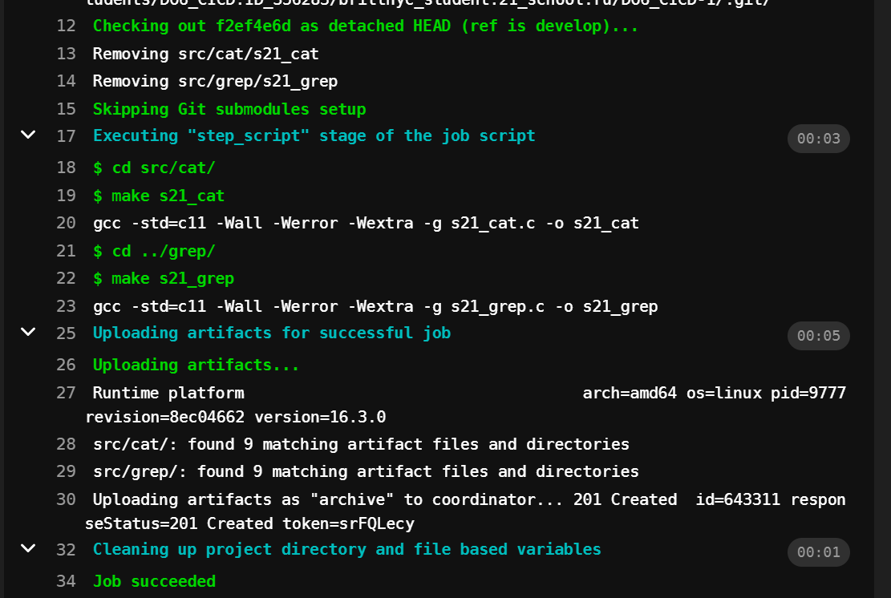
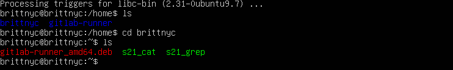

# Basic CI/CD

Разработка простого **CI/CD** для проекта _SimpleBashUtils_. Сборка, тестирование, развертывание.

### Part 1. Настройка **gitlab-runner**

##### Скачать и установить на виртуальную машину **gitlab-runner**

Воспользуемся инструкцией из официальной документации gitlab-runner

1. Скачаем нужный пакет.

```
# Replace ${arch} with any of the supported architectures, e.g. amd64, arm, arm64
curl -LJO "https://gitlab-runner-downloads.s3.amazonaws.com/latest/deb/gitlab-runner_${arch}.deb"
```

2. Установим gitlab-runner, используя скачанный пакет.

```
dpkg -i gitlab-runner_<arch>.deb
```

##### Запустить **gitlab-runner** и зарегистрировать его для использования в текущем проекте (_DO6_CICD_)

1. Вводим команду sudo gitlab-runner register.
2. Вводим URL https://repos.21-school.ru из поля в самом начале таска.
3. Вводим токен из поля в самом начале таска.
4. Описание раннера. Я ничего особо осмысленного там не писала, но описание можно поменять позже.
5. Теги. Это очень важное поле, если неправильно указать тег, то пайплайн будет застревать, так как не будет активных раннеров. Поменять эти теги в этом проекте нельзя, потому нам, смертным пирам, запрещено лезть в настройки проекта, поэтому в случае ошибки придется перерегистрировать раннер, но на практике это проблема решается гораздо легче.
6. Maintance note. Можно оставить пустым.
7. Runner executor. Это исполнитель, на котором можно запускать сборки. В нашем случае выбираем shell, но чаще всего используется докер.
8. Вводим команду sudo gitlab-runner start. Раннер запустился.

### Part 2. Сборка

#### Написать этап для **CI** по сборке приложений из проекта _C2_SimpleBashUtils_:

Чтобы все заработало, пушим файлы с проектом C2_SimpleBashUtils в папку src и файл .gitlab-ci.yml в корневую директорию проекта. Пайплайн начнется автоматически, его работу можно отслеживать во вкладке "CI/CD". Нажав на отдельный job, можно посмотреть логи и вывод использованных команд.



Похожим образом пишем Part 3 и Part 4. И нужно обязательно не забывать установить различные утилиты на работающую машину, иначе пайплайн не будет работать.

### Part 5. Этап деплоя

Что делаем:

1. Соединяем первую и вторую машины, включив в "Сеть" у обоих второй адаптер. Второй адаптер проставляем как "Внутренняя сеть".
2. Редактируем конфиг в netplan, чтобы обе машины могли общаться между собой, принимаем настройки и через ping проверяем, что машины слышат друг друга.
3. Хорошо подходит утилита expect для переброски и установки файлов на удаленный сервер, однако она работает отдельно в файле с расширением exp.
4. Нам нужен bash файл, поэтому создаем deploy.sh и оттуда вызываем deploy.exp, где написаны все нужные команды для работы с файлами.


